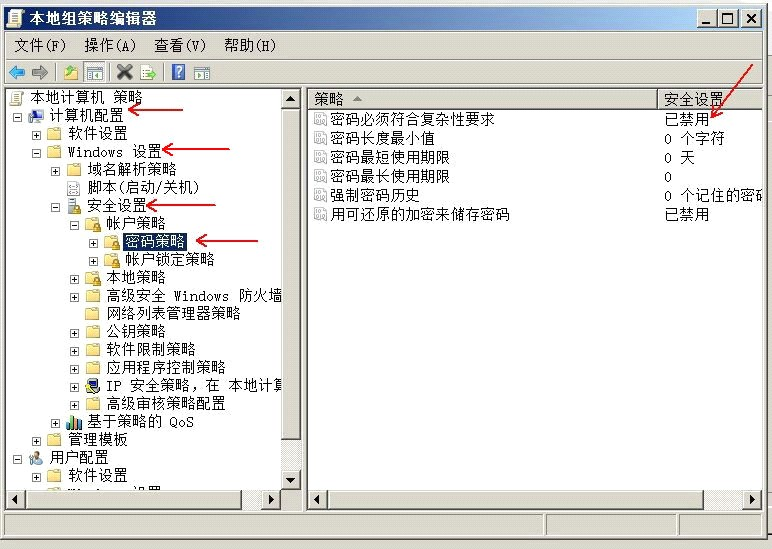
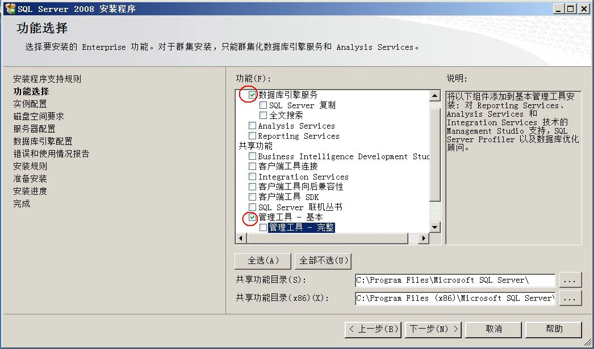
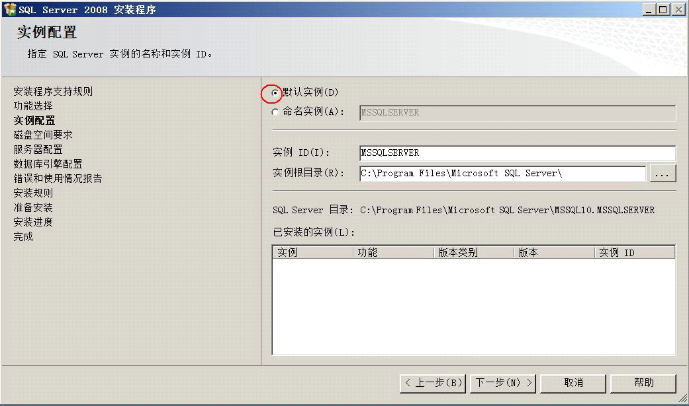
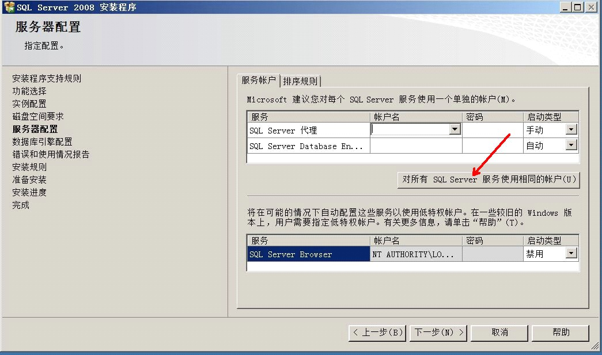
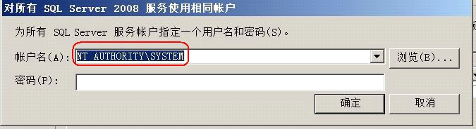
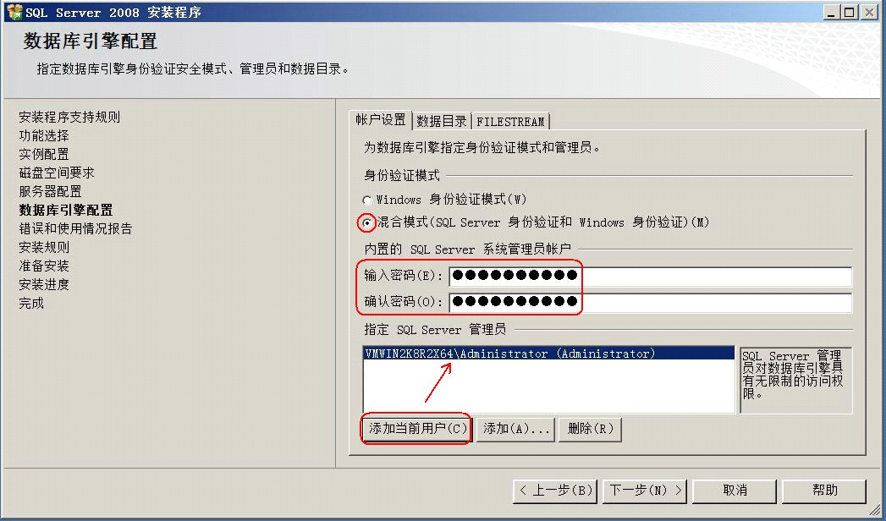
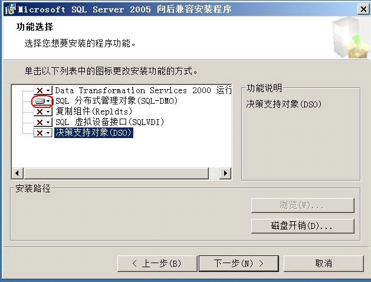

------

# 前言

中职计算机应用专业模拟服务器架设过程

<!---more--->

# 1、准备操作系统

1. 1 安装版本：Widnows Server 2008 R2

2. 2 禁用 “密码必须符合复杂性要求”<!--more-->

   组策略：

   操作：运行-gpedit.msc-计算机配置-windows设置-安全设置-账户策略-密码策略-密码必须符合复杂性要求-已禁用）

   

# 2、安装数据库

1. 安装版本：SQL Server 2008R2（安装时注意：默认实例、混合登录）

   

   

   

   

   

2. 安装SQL MDO（对应操作系统位数32或64）

   

# 3、安装应用软件

office 2010要完全安装；安装winrar；选择安装所要相应科目的应用软件（VC、VF等）。

# 4、授权写锁

1. 安装常用组件
2. 注册组件（将相关dll文件复制到windows/syswow64目录下，运行注册）。

# 5、安装考试系统服务器

1. 安装服务端（在C盘下会出现一个WLKS目录）
2. 安装软件更新
3. 还原数据库（需要安装dotnetfx45软件）
4. 设置授权服务自启动
5. 将6-WLKS压缩包解压，复制到相应目录下。

# 6、安装考试系统客户端

1. 安装应用软件，如：office 2010、VC、VF等。
2. 安装客户端
3. 配置客户端

